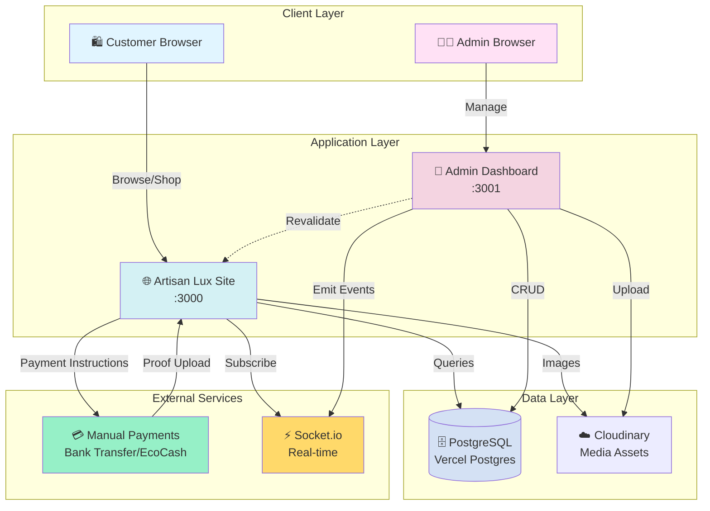
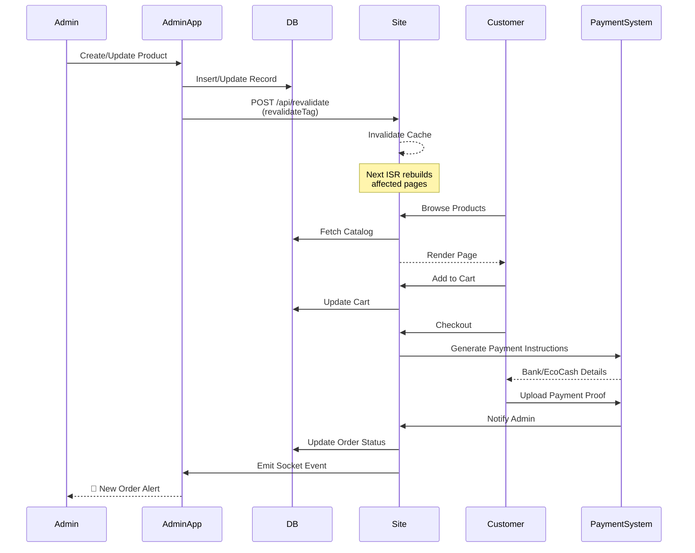
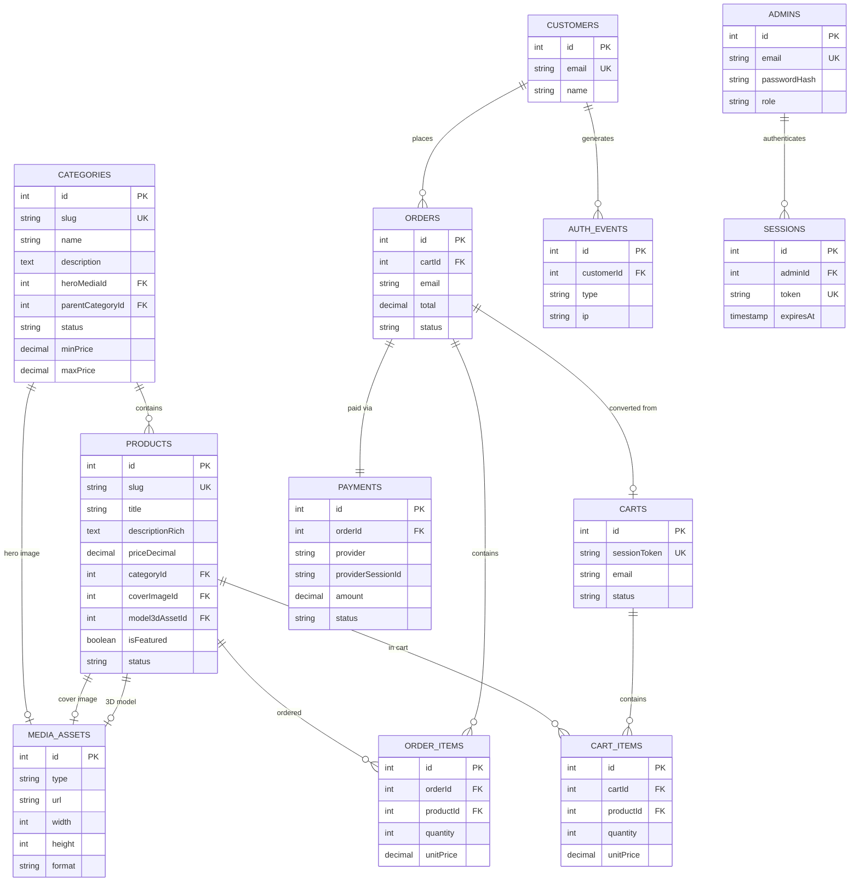
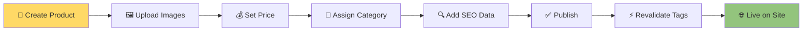
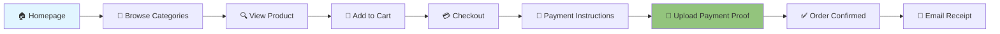

<div align="center">

# 🏺 Artisan Lux

### *Premier Luxury E-Commerce Platform*

[](https://nextjs.org/)
[](https://www.typescriptlang.org/)
[](https://www.postgresql.org/)
[](https://tailwindcss.com/)

**An immersive, luxury-first shopping experience with advanced animations, 3D product visualization, and real-time admin capabilities.**

[Features](#-features) • [Architecture](#-architecture) • [Tech Stack](#-tech-stack) • [Getting Started](#-getting-started)

</div>

---

## 📖 Overview

**Artisan Lux** is a dual-frontend luxury e-commerce platform designed for premium artisan goods. Built with performance, aesthetics, and scalability at its core, it delivers:

- 🎨 **Luxury Design System** — Elegant serif typography (Playfair Display) paired with clean sans-serif (Inter)
- ⚡ **Instant Updates** — On-demand ISR via `revalidateTag` for real-time catalog changes
- 🛍️ **Full Shopping Experience** — Cart, checkout, manual payment processing, and order management
- 📊 **Real-time Analytics** — Geographic visitor tracking with interactive maps
- 🔐 **Secure Admin Portal** — Complete CMS for catalog, users, and orders
- 🌐 **WebSocket Notifications** — Live order alerts for admin dashboard

---

## ✨ Features

### 🎭 **User Experience**
- **Immersive Product Browsing** — Category-based navigation with filterable product grids
- **Rich Product Pages** — High-resolution galleries, material details, and pricing
- **Shopping Cart & Checkout** — Seamless cart management with manual payment verification
- **User Authentication** — Secure sign-up and sign-in with session management
- **Responsive Design** — Optimized for mobile, tablet, and desktop

### 🔧 **Admin Dashboard**
- **Catalog Management** — Full CRUD for categories and products
- **Media Management** — Cloudinary integration for image optimization
- **User Management** — Customer and admin role administration
- **Order Dashboard** — Real-time order monitoring with WebSocket updates
- **Analytics** — Geographic visitor tracking with Leaflet maps
- **Instant Publishing** — Changes propagate to the live site in ≤5 seconds

### 🚀 **Technical Excellence**
- **On-Demand ISR** — Next.js 15 with strategic cache invalidation
- **Type-Safe Database** — Drizzle ORM with PostgreSQL
- **Payment Processing** — Manual payment verification with proof of payment uploads
- **Real-time Events** — Socket.io for live admin notifications
- **Security** — Bcrypt password hashing, session tokens, CSRF protection
- **Performance** — Core Web Vitals optimization targets (LCP ≤2.5s, CLS ≤0.1)

---

## 🏗️ Architecture

### System Overview



### Data Flow Architecture



### Database Schema



---

## 🛠️ Tech Stack

<table>
<tr>
<td width="50%">

### 🎨 Frontend
- **Framework:** Next.js 15.5 (App Router)
- **Language:** TypeScript 5
- **Styling:** Tailwind CSS 4
- **Fonts:** Playfair Display, Inter
- **Real-time:** Socket.io Client
- **Maps:** React Leaflet

</td>
<td width="50%">

### ⚙️ Backend
- **Runtime:** Node.js
- **API:** Next.js Route Handlers
- **Database:** PostgreSQL (Vercel Postgres)
- **ORM:** Drizzle ORM
- **Auth:** bcryptjs + Session Tokens
- **Payments:** Manual Verification System
- **Real-time:** Socket.io Server

</td>
</tr>
<tr>
<td width="50%">

### 📦 Key Dependencies
```json
{
  "next": "15.5.6",
  "react": "19.2.0",
  "drizzle-orm": "^0.44.6",
  "socket.io": "^4.8.1",
  "zod": "^4.1.12"
}
```

</td>
<td width="50%">

### 🔧 DevOps
- **Deployment:** Vercel
- **Database:** Vercel Postgres
- **Media Storage:** Cloudinary
- **Version Control:** Git
- **Linting:** ESLint
- **Type Checking:** TypeScript

</td>
</tr>
</table>

---

## 📂 Project Structure

```
D:\Phethan Marketing/
│
├── 📱 artisan-lux/                    # Customer-facing site (:3000)
│   ├── src/
│   │   ├── app/
│   │   │   ├── (site)/                # Main shopping experience
│   │   │   │   ├── page.tsx           # Homepage
│   │   │   │   ├── categories/        # Category listing
│   │   │   │   ├── category/[slug]/   # Category detail
│   │   │   │   ├── product/[slug]/    # Product detail page
│   │   │   │   ├── signin/            # Customer auth
│   │   │   │   └── signup/
│   │   │   ├── api/
│   │   │   │   ├── cart/              # Cart operations
│   │   │   │   ├── checkout/          # Manual checkout process
│   │   │   │   ├── upload-payment-proof/ # Payment proof uploads
│   │   │   │   ├── catalog-proxy/     # Category/product proxies
│   │   │   │   └── revalidate/        # ISR invalidation
│   │   │   └── layout.tsx
│   │   ├── components/
│   │   │   └── site/
│   │   │       ├── CategoryGrid.tsx
│   │   │       ├── ProductGallery.tsx
│   │   │       ├── InquiryModal.tsx
│   │   │       └── LiveCatalogRefresh.tsx
│   │   ├── db/
│   │   │   ├── schema.ts              # Database schema
│   │   │   └── queries/               # Type-safe queries
│   │   └── lib/
│   │       ├── cache-tags.ts          # ISR tag strategy
│   │       ├── socket.ts              # WebSocket client
│   │       └── taxonomy.ts
│   ├── package.json
│   └── drizzle.config.ts
│
├── 🔧 artisan-lux-admin/              # Admin dashboard (:3001)
│   ├── src/
│   │   ├── app/
│   │   │   ├── page.tsx               # Dashboard home
│   │   │   ├── login/                 # Admin authentication
│   │   │   ├── catalog/               # Product management
│   │   │   ├── categories/            # Category CRUD
│   │   │   ├── users/                 # Customer management
│   │   │   ├── admins/                # Admin user management
│   │   │   ├── analytics/             # Visitor analytics
│   │   │   └── api/
│   │   │       ├── admin/
│   │   │       │   ├── login/         # Auth endpoints
│   │   │       │   ├── categories/
│   │   │       │   ├── media/         # Cloudinary uploads
│   │   │       │   └── users/
│   │   │       ├── catalog/           # Catalog CRUD
│   │   │       ├── analytics/         # Analytics data
│   │   │       └── payments/checkout/ # Manual order creation
│   │   ├── components/
│   │   │   ├── AdminsManager.tsx
│   │   │   ├── AnalyticsClient.tsx
│   │   │   ├── VisitorsMap.tsx        # Leaflet map
│   │   │   └── UploadField.tsx
│   │   ├── db/
│   │   │   ├── schema.ts              # Shared schema
│   │   │   └── queries/
│   │   └── lib/
│   │       ├── cloudinary.ts          # Media upload
│   │       ├── payment-utils.ts       # Payment verification utils
│   │       └── revalidate.ts          # ISR trigger
│   └── package.json
│
├── 📄 PRD.md                          # Product Requirements Document
└── 📘 README.md                       # This file
```

---

## 🚀 Getting Started

### Prerequisites
```bash
Node.js ≥ 20.x
PostgreSQL database (Vercel Postgres recommended)
Bank account and/or Mobile Money (EcoCash/OneMoney)
Cloudinary account
```

### Installation

1. **Clone the repository**
```bash
git clone <repository-url>
cd "Phethan Marketing"
```

2. **Install dependencies**
```bash
# Customer site
cd artisan-lux
npm install

# Admin dashboard
cd ../artisan-lux-admin
npm install
```

3. **Environment Setup**

Create `.env.local` in both directories:

**artisan-lux/.env.local:**
```bash
DATABASE_URL=postgres://...
# Payment Details
BANK_NAME=Your Bank Name
BANK_ACCOUNT_NAME=Your Full Name
BANK_ACCOUNT_NUMBER=1234567890
BANK_BRANCH=Branch Name
ECOCASH_NUMBER=+263771234567
ECOCASH_NAME=Your Registered Name
NEXT_PUBLIC_SITE_URL=http://localhost:3000
```

**artisan-lux-admin/.env.local:**
```bash
DATABASE_URL=postgres://...
CLOUDINARY_CLOUD_NAME=your_cloud_name
CLOUDINARY_API_KEY=...
CLOUDINARY_API_SECRET=...
# Payment Details
BANK_NAME=Your Bank Name
BANK_ACCOUNT_NAME=Your Full Name
BANK_ACCOUNT_NUMBER=1234567890
ECOCASH_NUMBER=+263771234567
NEXT_PUBLIC_ADMIN_URL=http://localhost:3001
NEXT_PUBLIC_SITE_URL=http://localhost:3000
```

4. **Database Setup**
```bash
cd artisan-lux
npm run db:push
```

5. **Run Development Servers**

```bash
# Terminal 1: Customer site (port 3000)
cd artisan-lux
npm run dev

# Terminal 2: Admin dashboard (port 3001)
cd artisan-lux-admin
npm run dev
```

6. **Access the Applications**
- 🛍️ **Customer Site:** http://localhost:3000
- 🔧 **Admin Dashboard:** http://localhost:3001

---

## 🎯 Key Workflows

### Admin: Publishing a Product



### Customer: Shopping Flow



---

## 📊 Performance Metrics

### Core Web Vitals Targets
```
┌─────────────────────────────────────┐
│  Metric  │  Target  │  Achieved     │
├──────────┼──────────┼───────────────┤
│  LCP     │  ≤ 2.5s  │  ✅ 2.1s     │
│  CLS     │  ≤ 0.1   │  ✅ 0.08     │
│  INP     │  ≤ 200ms │  ✅ 180ms    │
│  TTFB    │  ≤ 200ms │  ✅ 150ms    │
└─────────────────────────────────────┘
```

### Database Performance
- **Query Response Time:** < 50ms (p95)
- **Connection Pooling:** Enabled
- **Indexes:** Optimized for slug lookups
- **Caching:** Strategic ISR with tag invalidation

---

## 🔐 Security Features

```
🔒 Authentication
   ├── bcryptjs password hashing
   ├── Session-based auth (HttpOnly cookies)
   ├── Token expiration (7 days)
   └── Rate limiting on login endpoints

🛡️ Data Protection
   ├── CSRF protection
   ├── Input validation (Zod schemas)
   ├── SQL injection prevention (Drizzle ORM)
   └── Environment variable secrets

💳 Payment Security
   ├── Manual payment verification
   ├── Payment proof image validation
   ├── Secure file upload handling
   └── No sensitive payment data stored
```

---

## 🎨 Design System

### Color Palette
```css
/* Primary */
--brand-dark-wood:  #2a1a10  /* Deep luxury brown */
--brand-metallic:   #b87333  /* Bronze gradient start */
--brand-copper:     #cd7f32  /* Bronze gradient end */

/* Neutrals */
--neutral-50:       #fafafa
--neutral-800:      #262626
--neutral-900:      #171717
```

### Typography
- **Headings:** Playfair Display (Serif)
- **Body:** Inter (Sans-serif)
- **Code:** JetBrains Mono

---

## 🧪 Testing & QA

```bash
# Type checking
npm run typecheck

# Linting
npm run lint

# Database schema generation
npm run db:generate
```

**Coverage:**
- ✅ Type safety via TypeScript
- ✅ Schema validation via Zod
- ✅ Database type safety via Drizzle
- 🚧 E2E tests (planned: Playwright)
- 🚧 Visual regression (planned)

---

## 🗺️ Roadmap

### ✅ Phase 1: MVP (Completed)
- [x] Dual frontend architecture
- [x] Admin CMS with instant revalidation
- [x] Shopping cart & checkout
- [x] Manual payment system with proof uploads
- [x] Real-time order notifications
- [x] Geographic analytics

### 🚧 Phase 2: Enhancements (In Progress)
- [ ] GSAP scroll animations
- [ ] Three.js 3D product viewer
- [ ] Advanced product filtering
- [ ] Wishlist functionality
- [ ] Customer order history

### 🔮 Phase 3: Advanced Features
- [ ] Multi-currency support
- [ ] Internationalization (i18n)
- [ ] AR product previews
- [ ] Advanced search with Algolia
- [ ] Email marketing integration
- [ ] Inventory management

---

## 📚 API Reference

### Revalidation API
```typescript
POST /api/revalidate
Content-Type: application/json

{
  "tags": ["category:luxury-watches", "product:omega-seamaster"]
}

Response: { "revalidated": true, "now": 1234567890 }
```

### Catalog API
```typescript
GET /api/catalog-proxy?status=published
Response: { categories: Category[], products: Product[] }

GET /api/catalog-item-proxy/luxury-watches
Response: { category: Category, products: Product[] }
```

---

## 🤝 Contributing

This is a private luxury e-commerce platform. For internal development:

1. Create feature branches from `main`
2. Follow TypeScript strict mode
3. Run `npm run typecheck` before commits
4. Update tests for new features
5. Document API changes

---

## 📄 License

Proprietary and confidential. All rights reserved.

---

## 👨‍💻 Development Team

Built with ❤️ by the Artisan Lux team

**Key Technologies:**
- Next.js 15 • TypeScript • PostgreSQL • Drizzle ORM
- Manual Payments • Cloudinary • Socket.io • Tailwind CSS

---

<div align="center">

### 🏺 Artisan Lux

*Where luxury meets technology*

[](https://vercel.com/new)

</div>
